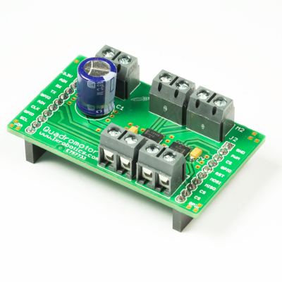

💾 Quadromotor BoosterPack
==========================

# 📸 Image

# 📂 Description

The Quadromotor BoosterPack in combination with a MSP430 Launchpad facilitates the control of a 1, 2 or 4 DC motors, or alternatively  of 2 stepper motors. Additionally, outputs of the motor drivers can be connected in parallel. Therefor, two motors with an maximum output current of 2 A can be controlled, or one motor with an maximum output current of 4 A. For a quick and easy start a sample Code Composer Studio project (written in programming language C) is available.

**Features**

* Control of 1, 2 or 4 DC motors OR 
* Control of 2 stepper motors
* Speed and rotational direction adjustable
* Supply voltage range: 4 V to 16 V
* Output current per motor for 4/2/1 motors: 1 A / 2 A / 4 A
* To be used with MSP430 Launchpad
* Sample projects available for Code Composer Studio

# 🎥 [Video](images/quadromotor_booster_pack_demo.mp4)
